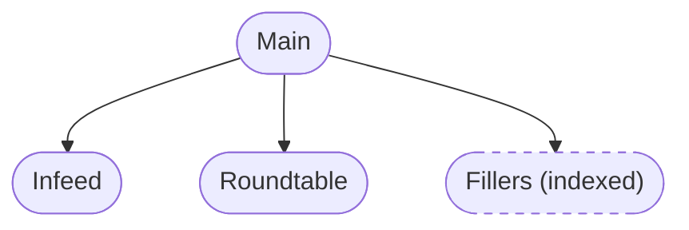
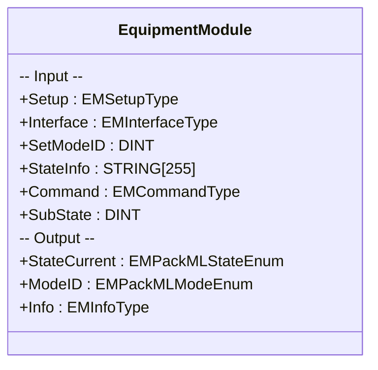
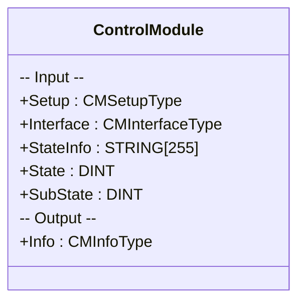
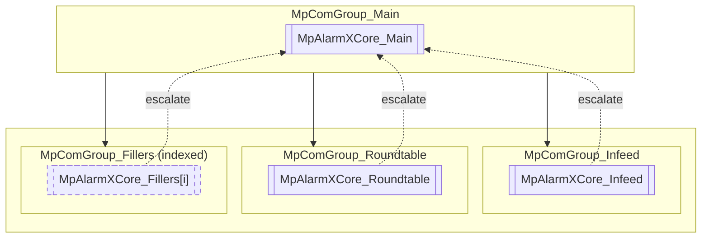

**BRDK Architecture**

Programming guidelines

# Requirements

Development tool: Automation Studio 4.12 and newer  
Hardware: All CPU's

# Table of Contents

1. [Motivation](#motivation)  
2. [Architecture](#architecture)  
	 2.1. [Hierarchy and service modules](#hierarchy-and-service-modules)  
	 2.2. [Equipment modules](#equipment-modules)  
	 2.3. [Use of control modules](#use-of-control-modules)  
	 2.4. [Program structure](#program-structure)  
3. [Naming conventions](#naming-conventions)  
	 3.1. [Variable naming](#variable-naming)  
	 3.2. [Structure / type naming](#structure-type-naming)  
	 3.3. [Constants naming](#constants-naming)  
	 3.4. [Global structures and variables naming](#global-structures-and-variables-naming)  
	 3.5. [Pointer variable naming](#pointer-variable-naming)  
	 3.6. [IO variable naming](#io-variable-naming)  
	 3.7. [Enumerator naming](#enumerator-naming)  
	 3.8. [Function block naming](#function-block-naming)  
4. [Descriptions in .var and .typ files](#descriptions-in-var-and-typ-files)  
5. [Alarm system](#alarm-system)  
6. [General coding guidelines](#general-coding-guidelines)  
7. [Handling non-indexed code in indexed modules](#handling-non-indexed-code-in-indexed-modules)  

# Motivation

The purpose of this document is to describe the architecture of Automation Studio projects in BRDK, as well as setting out fixed rules for naming conventions, structures, etc.

# Architecture

All projects must be set up in the framework and architecture described in this document. All machines are divided into equipment modules in a hierarchical state machine, following the PackML standard and based on the BrdkPackML library.

## Hierarchy and service modules

BRDK uses templates for equipment modules (with and without servo axis), indexed equipment modules, and a selection of services which can be connected in a hierarchical structure. Individual modules can be named according to machine requirements.

**Figure 1:** Module hierarchy (Main with three child modules; Fillers indexed). Take note that Fillers is an indexed module, meaning that one task will handle multiple instances of the same equipment module. 



Services provide standard solutions for: Alarm handling, File handling, Config & recipe handling, Language selection, Logger, IO handling for simulation.

Templates allow advanced process-related code to be added freely. Only restriction: keep naming conventions, structure and PackML state hierarchy.

## Equipment modules

All electromechanical parts of the machine must be divided into individual equipment modules, which must be interconnected in a hierarchy, as shown previously. How this should be done, requires an understanding of the machine, and it´s processes.  

There will always be a `“Main”` module in the top of the hierarchy. This module will be the one that handles normal start/stop functionality of the machine, and underlying modules in the parent/child relation will then follow the states of the `Main` module, according to the `PackML` standard.   

Equipment modules are implemented as function blocks of type `EquipmentModule` from the `BrdkPackML` library.

**Figure 2:** EquipmentModule interface (detailed)



An equipment module must always have it´s own separate task. If the machine must support several instances of the same equipment module, it will be implemented as an array of `EquipmentModule` function blocks, which will then be called in a loop in the task. The way the template for indexed modules is implemented, it basically handles all instances of the module, so that the application programmer can program the process, in the exact same way as a single instance equipment module.

## Use of control modules

Control modules encapsulate hardware-near logic and may be function blocks or standalone tasks using `ControlModule` function block.

**Figure 3:** ControlModule interface (detailed)



If a control module is implemented as a function block, it should be done as a local function block in the task. Avoid implementing the control module in a user library. The reasoning for this is, that a user library is not download safe, meaning that any code change in the control module code, will require a reboot of the PLC, which is not desirable.  

In either case, the interface of the control module should add a useful abstraction layer from the code or function blocks inside it. If the interface of the control module has largely the same interface as the function block(s) used internally in the control module, then this is usually a clear indicator that the use of a control module was not required. 

If using a single servo axis, it will often not make sense to implement as a control module, since the `mpAxisBasic` function block already encapsulates all basic axis functionality. This usually just leads to an unnecessary layer, which does not add to the readability of the code. 


## Program structure

**Figure 4:** Project structure

```
ProjectName/
├─ Documentation/
├─ Global.typ
├─ Global.var
├─ Libraries/
├─ Main/                   # Parent equipment module
│  ├─ MainAlarms.tmx       # Alarm texts
│  ├─ global.typ           # Global data types
│  ├─ global.var           # Global variables
│  ├─ Main/                # Task folder
│  │  ├─ local.st          # Init, cyclic, exit
│  │  ├─ production.st     # Production mode implementation
│  │  ├─ maintenance.st    # Maintenance mode implementation
│  │  ├─ manual.st         # Manual mode implementation
│  │  ├─ local.typ         # Local data types
│  │  ├─ local.var         # Local variables
│  ├─ Infeed/              # Child equipment module
│  ├─ Roundtable/          # Child equipment module
│  ├─ Fillers/             # Indexed equipment module
├─ Services/
│  ├─ Config/
│  ├─ FileHandling/
│  ├─ SimIoDelete/         # IO simulation / delete service
│  └─ (other services)
```
Each equipment module (e.g. Infeed) will have its own package, with contents as listed here: 

`ModuleNameAlarms.tmx`

This file contains texts for all alarms related to the module. The texts can be stored in all relevant languages. Actual implementation of alarms is covered later in this document.

### Global Types

`global.typ`: Type declaration file for global interface structures and config/recipe structures. 
Global structures are used for interfacing between modules. Indexed modules will have an array of its global structures, so that each instance can be addressed individually.  
Ideally everything would be local and contained within each module and all interfacing would be done with PV mapping. The implementation and practical use of PV mapping is useless and thereby benched for now.

```
gModuleNameIfType
	├─ Status (gModuleNameStatusType)
	├─ Cmd    (gModuleNameCmdType)
	├─ Par    (gModuleNameParType)      # optional

gModuleNameConfigType
	├─ ConfigPar1 

gModuleNameRecipeType
	├─ RecipePar1 

```

`gModulfNameIfType`: The global interface type. All tasks global interface structures have these substructures: 

 

- `gModuleNameStatusType`: Contains all status variables from the module that are relevant for others. Only the module itself updates these variables. 

 

- `gModuleNameCmdType`: Contains all commands that the module can receive from other modules. 
To avoid timing issues and race conditions between modules running in different cycletimes, commands must always be implemented in the following way: The external module will set the command TRUE. The module receiving the command will then reset the command to FALSE and start executing the command. In that way, only rising edge on the command input will trigger execution. 
Level sensitive commands and status output are not timing critical. For example, the McAxisBasic functionblock has a Power input, which powers on the axis. This input is level sensitive, and not sensitive to timing. 

 
- `gModuleNameParType`: (optional) Contains any parameters that can be given to the module, from other modules. If the module needs parameters for executing the commands, these can be placed in this structure. 

`gModuleNameConfigType`: Contains configuration parameters for the local module.  

`gModuleNameRecipeType`: Same as above but for recipe parameters and registered with the recipe service. 

### Global Variables

`global.var`: Variable declaration file for global variables. If the module is indexed (an array of identical modules), the variables will be arrays. 
```
gModuleNameInterface  (gModuleNameInterfaceType)
gModuleNameConfig     (gModuleNameConfigType) # Retain
gModuleNameRecipe     (gModuleNameRecipeType) # Retain

```

`gModuleNameInterface`: Instance of gModuleNameIfType 

`gModuleNameConfig/Recipe`: Instance of gModuleNameConfigType/RecipeType 
These variable are retained, meaning that data is preserved through a warm restart of the target (which also includes power cycling the target) 
The reason these are individual variables, and not just part of gModuleNameIfType, is that it is not possible to make just part of a structure retained – only a complete structure can be set up as retained. 
 
Config and recipe are global to avoid extra mapping through global interface from one module to another. 

 

These variables are automatically registered with the config/recipe service, which can store the values in .xml/.csv files on a file device (USB or internal flash, see brdkFile). 

### Local Task Files

`local.st`: Init, Cyclic and Exit parts of the task for the module. All predefined PackML modes are called here, and references for dynamic variables are configured. Code that must be executed in all modes, should be located here. Function block calls are typically done here.  

 

`production.st`: Implementation of the production mode of the equipment module. This is typically where the majority of the module’s functionality is implemented.  

 

`maintenance.st`: Implementation of the maintenance mode of the equipment module. If the module has a maintenance or cleaning routine, then it will be implemented here. The mode is optional, and if not needed, the mode and file can be deleted. 

 

`manual.st`: Implementation of the manual mode. Manual functions of the module can be implemented here. This mode is also optional.  

 

`alarm.st`: Implementation of the alarm handling using BrdkAlarmControl function block. 

 
### Local Task Types

`local.typ` Definition of all local types.  

```
localType
	├─ em                       (EquipmentModule)
	├─ hw                       (localHwType)
	├─ configName               (STRING[80])
	├─ recipeName               (STRING[80])
	├─ MpRecipeRegPar_Config    (MpRecipeRegPar)
	├─ MpRecipeRegPar_Recipe    (MpRecipeRegPar)
	├─ hmi                      (hmiType)

hmiType
	├─ example                  (BOOL)

localHwType
	├─ aiExample                (INT)

alarmType
	├─ MpAlarmXCore_ModuleName  (MpAlarmXCore)
	├─ BrdkAlarmControl_        (BrdkAlarmControl[N])
```
`localType`: Contains all local variables, function blocks and sub-structures. `em` and `cm` function blocks are pre-declared here, as well as instances of the below types  

`hmiType`: Contains all variables that have bindings to the hmi. All variables that are connected to the HMI must be part of an hmiType structure. Only exceptions are the recipe, config, 2-way bindings, hw and global interface.status structures, which may also be connected directly the the hmi. 

`hwType`: Contains all io mapped variables for the local module. 

`alarmType`: Contains the MpAlarmXcore associated with the module and an array of BrdkAlarmControl function blocks. Increase the size of the array if more alarms are needed. 


### Local Task Variables

`local.var` Definition of all local types.  

```

local           (localType)
this            (localType)                 # Reference
hmi             (hmiType)                   # Reference
em              (EquipmentModule)           # Reference
interface       (gModuleNameInterfaceType)  # Reference
recipe          (gModuleNameRecipeType)     # Reference
config          (gModuleNameConfigType)     # Reference

```
`this`: Dynamic reference to localType. If the module is indexed, then this will always access the memory location of the current index of the local structure. When programming, always use this. local should only ever be used in very specific cases, i.e if needing to scan through all the instances of the module in a FOR loop.  

`hmi`: Dynamic reference to local.hmi. This gives easier access to the hmi structure of the module. When accessing hmi variables in the code, always use the hmi reference. 

`em`: Dynamic reference to local.em function block.  

`interface`: Dynamic reference to the global interface of the module (gModuleNameInterface).If the module is indexed, then interface will access the current index of the gModuleNameInterface array.  

`recipe`: Dynamic reference gModuleNameRecipe. If the module is indexed, then recipe will always access the current index of gModuleNameRecipe. 

`config`: Dynamic reference to gModuleNameConfig. If the module is indexed, then config will always access the current index of gModuleNameConfig. 


## Naming conventions

Meaningful, descriptive, readable names. CamelCase for most identifiers, lowercase initial for variables. Single letters allowed for small loop counters (`i`, `j`, `k`).

### Variable naming

Example:
```
actPressure := actForce / pistonArea;
commandCount := commandCount + i;
```

### Structure / type naming

User types: start lowercase, CamelCase, end with `Type`.

Substructure pattern: `<parent><NewName>Type`

Example:

```
recipeType
	├─ name              (STRING[80])
	├─ ingridient_1      (STRING[80])
	├─ activateLight     (BOOL)
	├─ time              (recipeTimeType)

recipeTimeType
	├─ hour              (USINT)
	├─ min               (USINT)
	├─ sec               (USINT)

```

### Constants naming

SCREAMING_SNAKE_CASE. 

Example:
```
MAX_RETRY_COUNT     := 5;
DEFAULT_TIMEOUT_MS  := 2000;
EM_NOX_INSTANCES    := 8;
CFG_FILENAME        := 'config.xml';
```

### Global structures and variables naming

Prefix global variables and structures with `g` (except members inside a global structure). Example:
```
gMainInterface : gMainIfType;
gMainConfig    : gMainConfigType;
```

### Pointer variable naming

Prefix `p` + descriptive name:
```
pAxisStatus : ^AxisStatusType;
pRecipeData : ^gModuleNameRecipeType;
```

### IO variable naming

Prefix indicates I/O type:

| Prefix | Type             | Example            |
|--------|------------------|--------------------|
| di     | Digital input    | diStartButton : BOOL |
| do     | Digital output   | doLampGreen : BOOL   |
| ai     | Analog input     | aiTankLevel : REAL   |
| ao     | Analog output    | aoValveSetpoint : REAL |
| at     | Temperature in   | atOvenTemp : REAL    |
| si     | Safety input     | siGuardClosed : BOOL |

Alternative: substructures inside `hwType` (e.g. `hw.di.startButton`).

### Enumerator naming

Enumeration name ends with `Enum`; members are `ENUMNAME_VALUE` SCREAMING_SNAKE_CASE with explicit numeric assignments.
Example:
```

alarmReactionEnum : (
	ALARMREACTION_NONE  := 0,
	ALARMREACTION_STOP  := 1,
	ALARMREACTION_ABORT := 2
);
```

### Function block naming

Instance name should begin with FB type:
```
TON_delay  : TON;
TON_0      : TON;                 (* single instance *)
TON_       : ARRAY[0..3] OF TON;  (* omit suffix numbers in arrays *)
```

## Descriptions in .var and .typ files

All entries must have descriptions. Include engineering unit in brackets `[unit]` within description where relevant.
Example snippet:
```
actPressure : REAL; (* Actual hydraulic pressure [bar] *)
cmdStart    : BOOL; (* Rising-edge start command *)
```

## Alarm system

Hierarchy mirrors equipment modules using `MpAlarmX` and `MpComGroup` per module; children escalate alarms upward as needed.

**Alarm hierarchy:**



**Alarm mapping table:** (example)

| Alarm Name      | Message (TextID)    | Code | Severity | Reaction   | Escalate |
|-----------------|---------------------|------|----------|------------|----------|
| notHomed        | $Roundtable:notHomed| 1101 | 3        | NONE       | No      |
| axisFault       | $Roundtable:axisErr | 1102 | 1        | ABORT      | Yes      |
| lowPressure     | $Main:lowPress      | 1005 | 2        | STOP       | Yes      |
| emergencyStop   | $Main:eStop         | 1001 | 1        | ABORT      | Yes      |

Severity reactions:
| Severity | Reaction | Notes |
|----------|----------|-------|
| 1        | Abort    | Must escalate to display in HMI |
| 2        | Stop     | Escalate if parent must react    |
| 3        | Warning  | Logged only (example)            |

**Alarm handling cyclic code:**
```
ACTION alarm:

    // Lock alarm
    this.alarm.BrdkAlarmControl_[0].Enable    := TRUE;
    this.alarm.BrdkAlarmControl_[0].MpLink    := ADR(mpAlarmRoundtableXCore);
    this.alarm.BrdkAlarmControl_[0].Name      := 'roundtableNotHomed';
    this.alarm.BrdkAlarmControl_[0].Condition := NOT interface.status.homingOk;
    this.alarm.BrdkAlarmControl_[0].Delay     := t#0s;
    this.alarm.BrdkAlarmControl_[0].Inhibit   := FALSE;
    this.alarm.BrdkAlarmControl_[0]();

    // Alarm handling function block for local module
    this.alarm.MpAlarmXCore_0(
        MpLink := ADR(mpAlarmRoundtableXCore),
        Enable := TRUE
    );

    // Check for local alarm reactions (after MpAlarmXCore has updated reactions)
    IF MpAlarmXCheckReaction(mpAlarmRoundtableXCore, 'abort') THEN
        em.Command.Abort := TRUE;
    END_IF;

    IF MpAlarmXCheckReaction(mpAlarmRoundtableXCore, 'stop') THEN
        em.Command.Stop := TRUE;
    END_IF;

END_ACTION
```

## General coding guidelines

- Edge detection: Do not use implicit `EDGEPOS/EDGENEG` in indexed modules; explicitly track old values.
- Call function blocks at end of scan, cyclically outside state machines (unless special case).
- Parameter assignment style (Figure 14 converted):
```
(* Recommended multiline FB call *)

this.TON_0.PT := config.delayTime;
this.TON_0.IN := TRUE;

...

this.TON_0();

```

Function blocks with execute inputs: reset the execute immediately after `Done` or in abort/stop PackML states to guarantee rising edge semantics.

## Handling non-indexed code in indexed modules

When implementing indexed equipment modules in an array, there is often the need to have some parameters, variables and code, which are not indexed. This has historically caused problems, because our implementation of indexed modules is done specifically to support the indexed modules themselves. 

 

**The problems are typically:**
 

- Code will need to run in local.st, because all the PackML modes are running inside the FOR loop. This looks messy and makes the local.st file harder to read. 
 

- Config and recipe parameters cannot be placed inside the local structures, since those are indexed. So often they will be placed in the config and recipe structures of the parent module, often Main. And will then need to be broadcast to the equipment modules through the global interface.status structure.  
 

- Variables cannot be declared inside the local “this” structure, since this is an array. This has often led to just a bunch of local variables, outside of a structure being declared in the local.var file.  

 

**The solution:**

To combat these problems, the following standard for handling non-indexed variables have been implemented: 

- Separate action file, .var and .typ files for non-indexed use is added to the local scope of the indexed equipment modules: 

```
FillersModule/
├─ local.st                (FOR loop over instances)
├─ local.typ               (array types)
├─ local.var               (arrays)
├─ localnonIndexed.st      (pre-loop logic)
├─ localnonIndexed.var     (single variables)
├─ localnonIndexed.typ     (single-instance types)
```
- Local config and recipe structures for non-indexed variables. These structures will then be registered to the global recipe and config handling system and saved in the same way as the local config/recipe structures.  Since they are declared in the local scope of the equipment module, they can be accessed directly in the code, eliminating the need for mapping through the global interface of another module. 

- Action file is called in the local.st cyclic code, before entering the FOR loop:

Non-indexed call placement:
```
PROGRAM _CYCLIC

    localNonIndexed;    // Run non indexed code

    FOR i := 0 TO NUM_Fillers DO

        this      ACCESS ADR(local[i]);
        em        ACCESS ADR(local[i].em);
        hmi       ACCESS ADR(local[i].hmi);
        interface ACCESS ADR(gFillersInterface[i]);
        config    ACCESS ADR(localConfig[i]);
        recipe    ACCESS ADR(localRecipe[i]);

        CASE em.ModeID OF
            MODE_PRODUCTION:   production;
            MODE_MAINTENANCE:  maintenance;
            MODE_MANUAL:       manual;
        ELSE
            em.Command.StateComplete := TRUE;
        END_CASE

        em();
        alarm;

    END_FOR;

END_PROGRAM
```

Local config/recipe structures for non-indexed values registered like indexed equivalents, eliminating broadcast mapping.

## Footer

www.br-automation.com  
BRDK Architecture / V0.0.0.1  
©2024/04/19 by B&R. All rights reserved.  
All registered trademarks are the property of their respective owners.  
We reserve the right to make technical changes.

